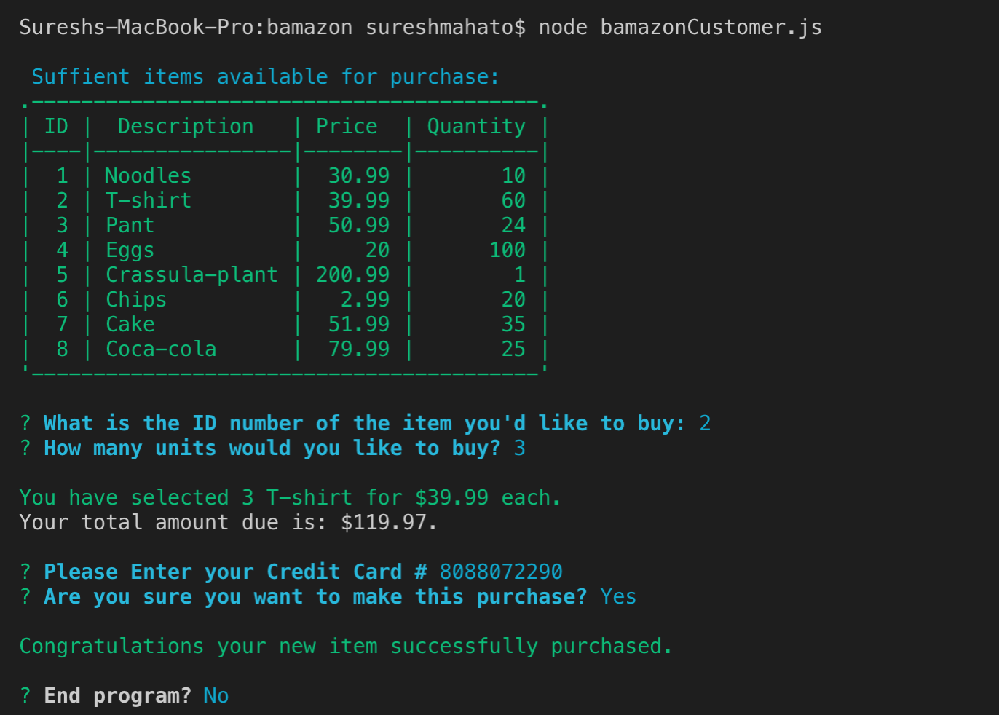
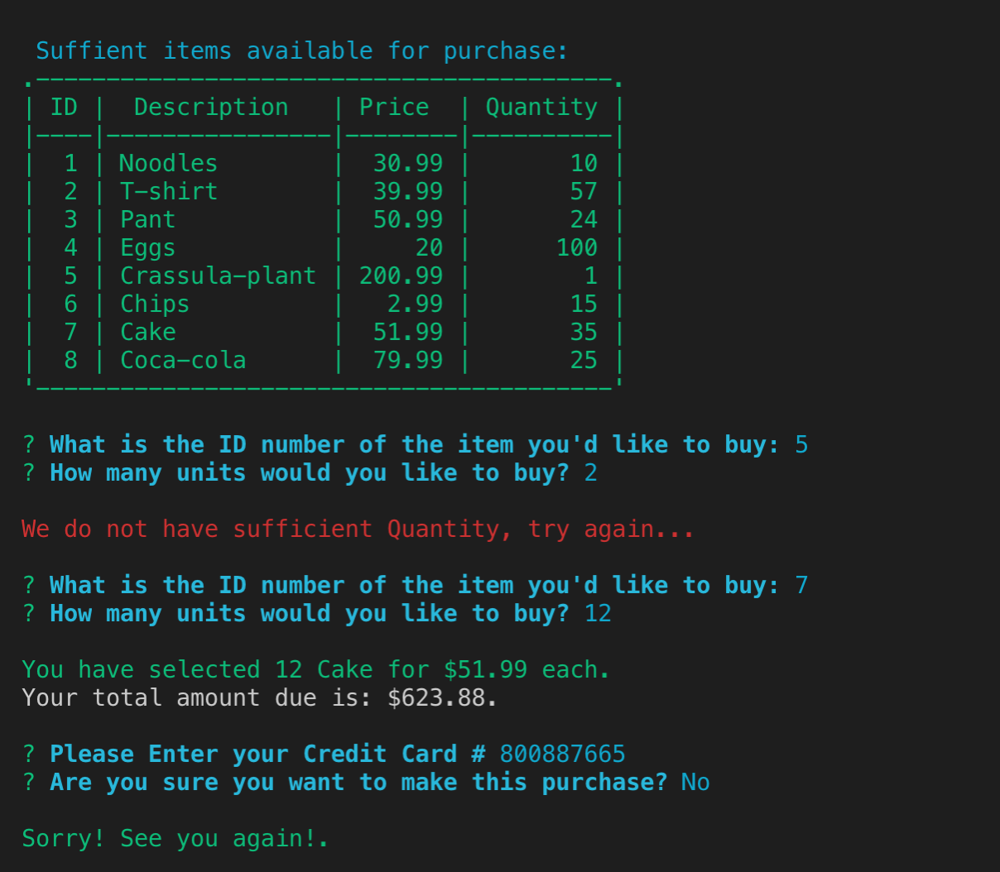

# bamazon

# Banaon Customer App

## SEE THE DEMO 

## View Sharable link below!!

https://drive.google.com/file/d/1ywZBqj9r0Xq3aACf4l2ThgrP_ih_W-Ge/view

## Dependencies used in this bamazone App:
    * ascii-table
    * chalk
    * colors
    * inquirer
    * mysql

        In this activity, i created  a Amazon-like storefront using  the MySQL. The app will take in orders 
    from customers and deplete stock from the store's inventory.

## Description

This application implements a simple command line based storefront using the npm [inquirer]package and the MySQL database package. The application presents interface for: **customer** 

## Getting Started 
1. Clone the repository. 
2. Run command `npm install` in Terminal.
3. Set up MySQL database.
4. Choose an interface below.

### What Each JavaScript Does

1. `bamazonCustomer.js`

    * Prints the products in the store.
    * Prompts customer which product they would like to purchase by ID number.
    * Asks for the quantity.
    * Type in the ID number of the item you'd like to buy: 
    * How many units would you like to buy? 
    * Please Enter your Credit Card # 
    * Are you sure you want to make this purchase? y/n

      * If there is a sufficient amount of the product in stock, it will return the total for that purchase.
      * However, if there is not enough of the product in stock, it will tell the user that there isn't enough of the product.
      * If the purchase goes through, it updates the stock quantity to reflect the purchase.
      * It will also update the product sales in the department table. 
=======
>>>>>>> f48b57137ce3a36a13a841bbc4ac9197750949ca
